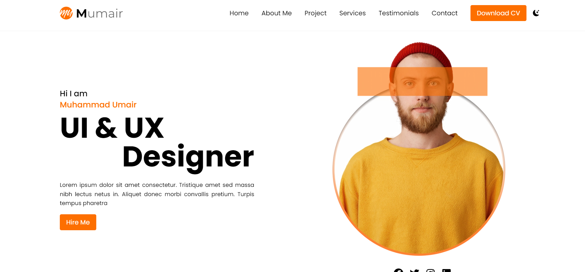
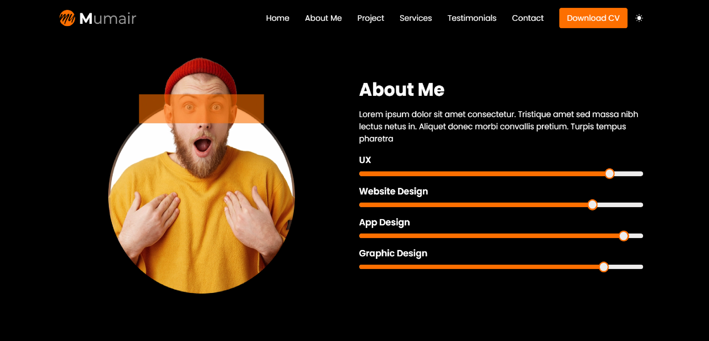

# Vista Reflection Portfolio

Vista Reflection Portfolio is an assignment project where the Figma design provided by the company was replicated with precision. This portfolio showcases the ability to transform a design into a fully functional and responsive web application.

## Technologies Used

- **React**: A JavaScript library for building user interfaces with reusable components.
- **Next.js**: A React framework for server-side rendering and static site generation.
- **Tailwind CSS**: A utility-first CSS framework for rapid UI development.
- **TypeScript**: A typed superset of JavaScript that enhances code quality and developer productivity.
- **React Icons**: A library for including popular icons in React projects.
- **Swiper**: A modern touch slider for creating responsive sliders.

## Features

- **Dark and Light Mode**: Switch between dark and light themes for better accessibility and user preference.
- **Responsive Design**: The layout is fully responsive and adapts to different screen sizes, ensuring a seamless experience across devices.

## How to Install and Run Locally

1. **Clone the repository:**

   ```base
   git clone https://github.com/amankashyap004/vista-reflection-portfolio.git
   ```

2. **Navigate to the project directory:**

   ```base
   cd vista-reflection-portfolio
   ```

3. **Install dependencies:**

   ```base
   npm install
   ```

4. **Open your browser and visit:**

   ```base
   http://localhost:3000
   ```

## Screenshots

Experience the modern, sleek, and intuitive design that this portfolio offers. Here are some glimpses of the project:





## Live Demo and Repository

- Live Demo: **[Vista Reflection Portfolio](https://vista-reflection-portfolio.vercel.app/)**
- GitHub Repository: **[Vista Reflection Portfolio](https://github.com/amankashyap004/vista-reflection-portfolio/)**

## Folder Structure

```base
VISTA-REFLECTION-PORTFOLIO/
├── .next/
├── node_modules/
├── public/
│   ├── documents/
│   │   └── documents
│   ├── images/
│   │   └── all images
├── src/
│   ├── app/
│   │   ├── favicon.ico
│   │   ├── globals.css
│   │   ├── layout.tsx
│   │   └── page.tsx
│   ├── components/
│   │   ├── home/
│   │   │   ├── About.tsx
│   │   │   ├── Contact.tsx
│   │   │   ├── HeroSection.tsx
│   │   │   ├── HomePage.tsx
│   │   │   ├── Projects.tsx
│   │   │   ├── Services.tsx
│   │   │   └── Testimonials.tsx
│   │   ├── ui/
│   │   │   ├── Button.tsx
│   │   │   └── ProgressBar.tsx
│   │   ├── Footer.tsx
│   │   ├── Header.tsx
│   │   ├── SocialMedia.tsx
│   │   └── ThemeSwitch.tsx
│   ├── utils/
│   │   └── ThemeProviders.tsx
├── .eslintrc.json
├── .gitignore
├── next.config.mjs
├── package-lock.json
├── package.json
├── postcss.config.mjs
├── README.md
├── tailwind.config.ts
└── tsconfig.json
```

## Future Enhancements

- Interactive Animations: Enhance user experience by adding more interactive animations and transitions.
- Multilingual Support: Add support for multiple languages to reach a broader audience.

Feel free to contact me for any queries or suggestions.
